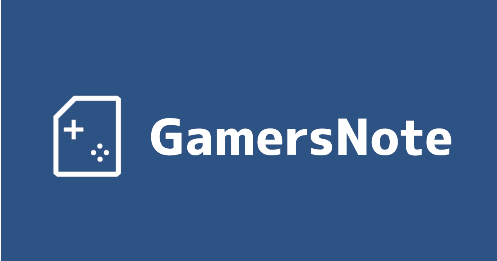
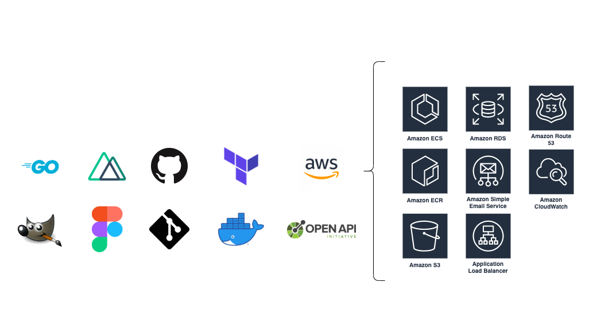
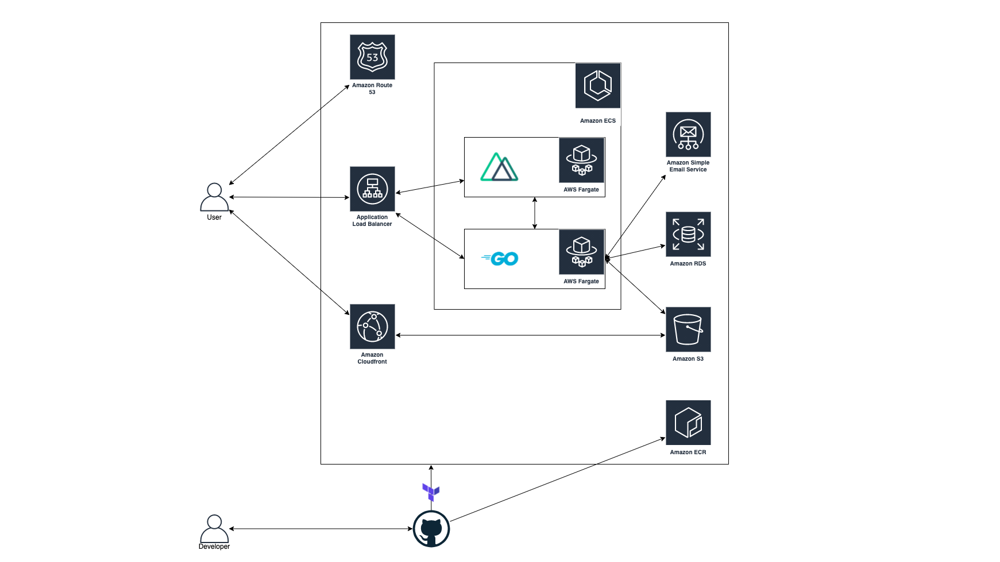

# GamersNote

ゲームに関する記事を投稿できるメディアプラットフォーム「[GamersNote](https://gamersnote.com)」を開発しました。

## GamersNoteとは？

GamersNoteはゲームに関する記事を投稿できるメディアプラットフォームです。現時点で実装されている機能は以下の通りです。

- ユーザー登録・退会
- プロフィール編集
- ログイン・セッション管理
- 記事の閲覧・投稿・編集・削除
- 記事にいいねをつける
- 記事にコメントする

## 使われている技術

使用した技術は以下の通りです。

- Golang (go-swagger)
- Typescript (Nuxt.js)
- AWS
- Terraform
- Docker
- Git
- GitHub (GitHub Actions)
- OpenAPI (SwaggerEditor, OpenAPIGenerator)
- GIMP（ロゴ、favicon）
- Figma（画面設計）

## アーキテクチャ

アーキテクチャは以下の図のようになります。VPCなど細かいところは省きました。

ECSを用いてサービスを稼働させています。Nuxt.jsを用いたフロントエンドを配信するサービスと、Goで作成したAPIのサービスが動いています。その他RDSやS3などのAWSリソースを使っています。

また、デプロイとインフラの管理にTerraformを用いています。GitHubにpushされるとGitHubActionsによりデプロイが行われます。Terraformではほとんどのインフラを管理していますが、IAMとCloudFrontとSESはTerraformで管理していません。
## なぜこの作品を作ったのか？

GamersNoteを作った理由は以下の2つです。

1つ目は、文字でゲームについて発信するプラットフォームがあったら面白いかなと思ったからです。イメージとしては[note](https://note.com/)をゲームに特化させた感じです。攻略情報に限らず、ゲームに関するエッセイや日記、考察のようなものも気軽に発信できるような場所を作りたいと考えました。

2つ目は、私自身ゲームが好きだからです。ポートフォリオ作るにあたってモチベーションの維持は大切なことだと思います。私の好きなゲームに関連させた作品を作ることでモチベーションを維持しようと考えました。

## なぜポートフォリオを作ろうと思ったのか？

ポートフォリオを作ろうと思った理由は以下の2つです。

1つ目は、私はエンジニアとして就職したいと考えており、自分の技術力を示すものが必要だと考えたからです。私は、アルバイトで1年程開発を経験したことがありますが、そのコードは外に見せることができないため、自分で1から作る必要があると考えました。

2つ目は、興味のある技術を使って開発したかったからです。アルバイトでは、Node.jsを用いたAPIの作成->Vue.jsでフロントエンドの作成->Flutterでアプリの作成という順番で開発を経験したのですが、Flutterを触った時に静的型付言語がすごく開発しやすいと感じ、GoやTypeScriptに興味を持ちました。また、それまでスクリプト言語であるJavaScriptでしかAPIを作ったことがなかったので、コンパイル言語でも作ってみたいという興味や、サーバーサイドレンダリングへの興味もあり、バックエンドをGoで、フロントエンドをNuxt.jsで作ってみようと考えました。

## なぜその技術を選んだのか

### OpenAPI (Swagger)を用いた理由

今回はSwaggerEditorでAPI仕様書を作成し、OpenAPIGeneratorなどを使ってAPIを叩く部分(axios)とAPIのルーティングとバリデーション(go-swagger)を自動生成する開発スタイルを選択しました。なぜこのような開発スタイルをとったかというと、アルバイトで開発をしていた際に、APIを開発している側とフロントを開発している側で認識のズレが生じて、API側の人がフロントのコードを修正したり、フロント側の人がAPIのコードを修正するなど、効率の悪い開発スタイルになっていて、それを解決してみたいと考えたからです。仕様書から自動生成することで、フロントはビューとロジックの開発に集中でき、バックはモデルの開発に集中できるので効率が良くなると思いました。今回は1人で開発をしたので、あまり意味がありませんでしたし、逆に仕様書を作ったり自動生成されたコードを理解するのに時間がかかって効率が悪くなってしまいましたが、こういう開発スタイルもあるということの勉強にはなりました。

### ECSを使った理由

コンテナオーケストレーションサービスを使ってみたかったからです。アルバイトをしていた時は、EC2上でDockerコンテナを動かしてサービスを稼働させていました。せっかくDockerを使うのであればコンテナオーケストレーションサービスを使ってみたいと思いました。Kubernetesを実行できるEKSも選択肢に入りましたが、そこまで大きなアプリケーションを作る訳でもないし、勉強にコストがかかりそうだったのでECSを使うことにしました。
### バックエンドにGo + go-swaggerを選んだ理由

Golangに興味があったからです。それまでスクリプト言語かつ動的型付けであるJavaScript(Node.js)でしかAPIを作成したことがありませんでした。なので、コンパイル言語や静的型付言語で開発したいと考えており、その時候補に上がったのがTypeScriptとGoでした。どちらでも良かったのですが、バックエンドにGoを使っている企業が多い印象があったので、需要の高そうなGoを選択しました。

go-swaggerを選んだ理由は、OpenAPI + Goを用いたフレームワークで最も主流だったからです。

### フロントエンドにTypeScript + Nuxt.jsを選んだ理由

TypeScriptに興味があったのと、サーバーサイドレンダリングに興味があったからです。TypeScriptに興味があったのは上記で述べた通りです。サーバーサイドレンダリングに興味があった理由は、アルバイトではVue.jsをnginxで配信する形態をとっていて、SPAとSSRでどのように違うのか知りたかったからです。
## 頑張ったことは何か？

今回使ったほとんどの技術が初めて触るものだったので、うまく動かないなど躓くところが多く、その度にめげずに原因を調べて試行錯誤したことは頑張ったと言えると思います。

## 工夫したことは何か？

OpenAPIを使った開発は、アルバイトで感じていた問題を解決するために取り入れた私なりの工夫です。

## 反省点は何か?

反省点は以下の2つです。

1つ目は、機能が少ないことです。インフラや開発手法に時間を割いた結果、肝心の機能の作成に時間をあまり使えませんでした。フォロー、フォロワー機能などは時間がある時に追加しようと思っています。また、別のアプリケーションを作る際には今回のようにならないように、バックエンドをFirebaseなどのBaaSを使ったり、認証部分はIDaaSを使ったりして、ロジックの作成に集中できるような工夫をしたいと思いました。

2つ目は、テストを書いていないことです。テストについての勉強に時間をさけませんでした。フロントエンドとバックエンドでテストを書く必要があり、単体テストや結合テストなどを考えるとテストを書く余裕がありませんでした。APIに関してはリポジトリやハンドラーなどはInterfaceとして切り出し、中身の実装をモックできるようにはしているのでテストを書こうと思えば書ける状態にはしました。

